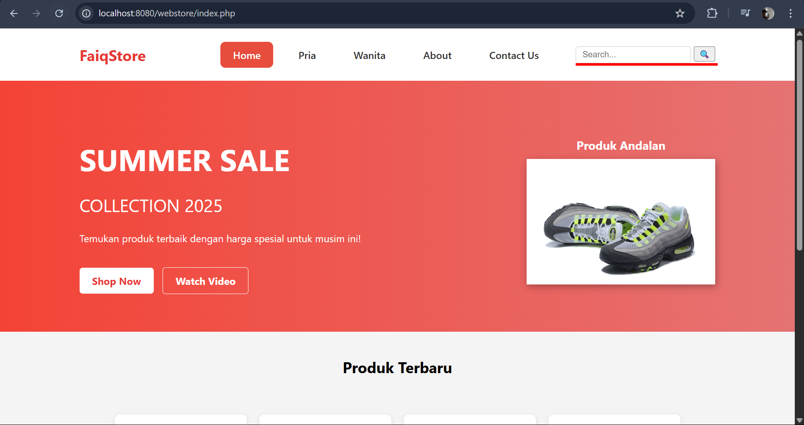
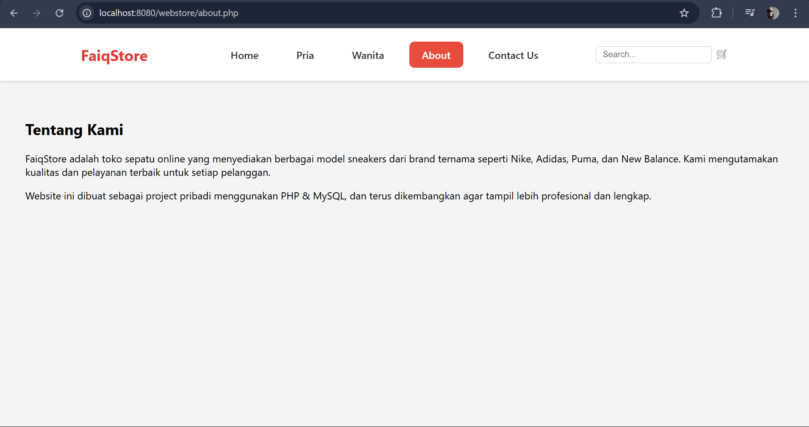
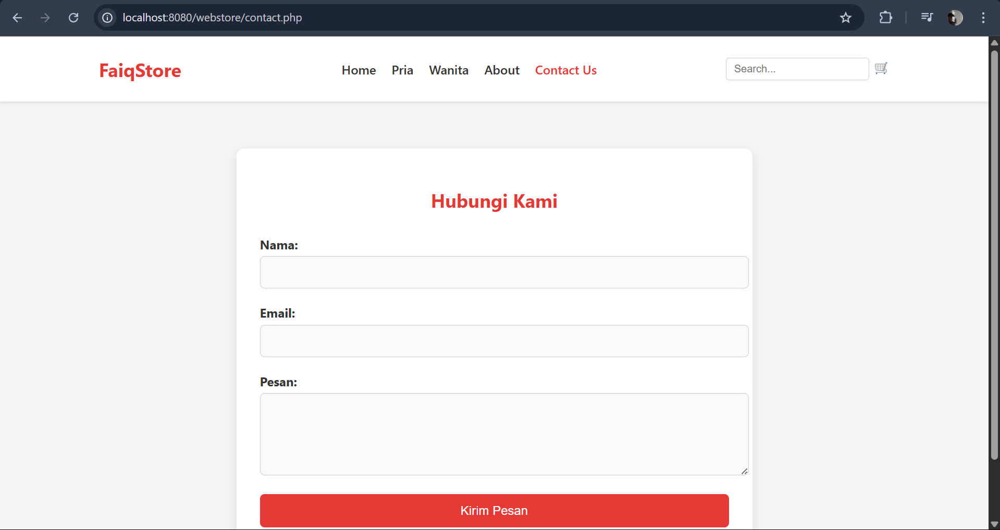

# FaiqStore 

**FaiqStore** adalah website sederhana berbasis PHP dan MySQL untuk penjualan sepatu.

## Fitur Utama

- Lihat daftar produk sepatu pria & wanita
- Halaman detail produk
- Formulir pemesanan dan pembayaran
- Fitur pencarian produk dengan live suggestion
- Responsive dan mudah digunakan

## Teknologi

- PHP Native
- MySQL
- HTML/CSS/JavaScript
- XAMPP (Localhost)

## Struktur Folder
webstore/
│
├── index.php
├── gender.php
├── contact.php
├── about.php
├── search.php
├── db.php (ignored)
├── css/
├── images/
└── ...

## Preview

  
  
  
  
  

## Note

File `db.php` tidak diunggah ke GitHub karena mengandung kredensial database (sudah di-`.gitignore`).

---

## Author

Muhammad Faiq Zacky ([@fqzcky](https://github.com/fqzcky))

